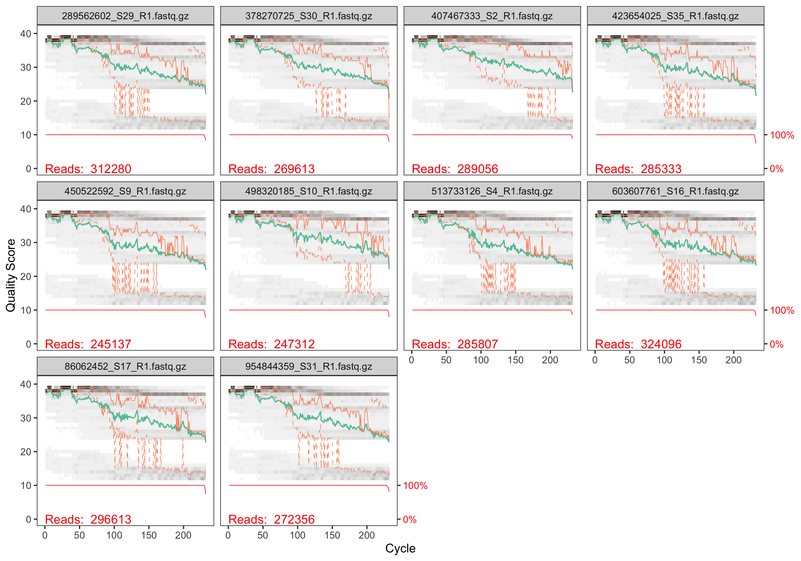
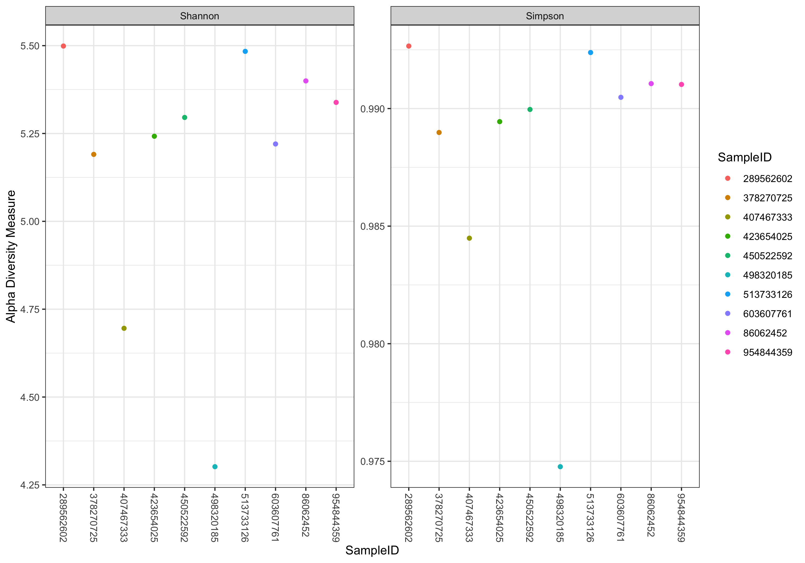
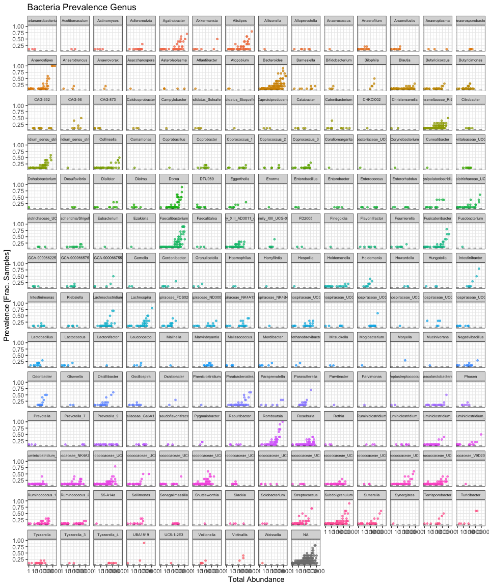
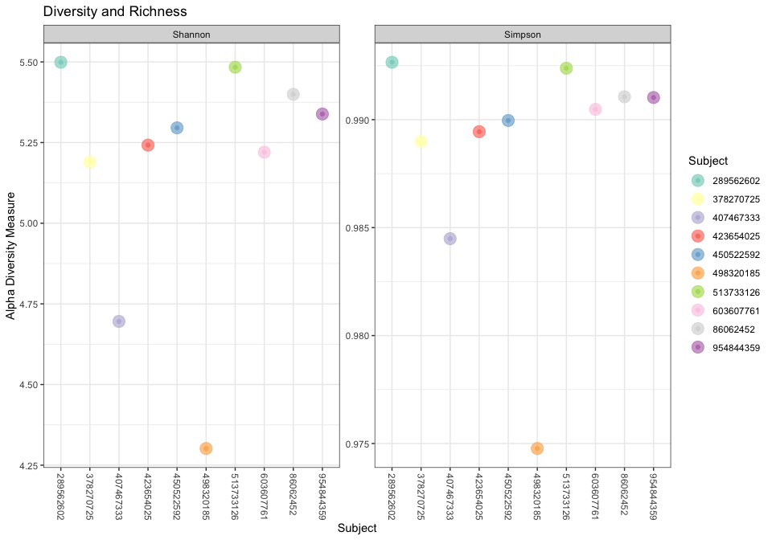

Part II Project - Illumina Analysis
================
Dalia Bornstein
2024-11-21

- [Load Libraries](#load-libraries)
- [List Names in Functional Way](#list-names-in-functional-way)
- [Plot Quality Profiles](#plot-quality-profiles)
  - [Forward](#forward)
  - [Reverse](#reverse)
- [Filter and Trim](#filter-and-trim)
- [Learn Error Rates](#learn-error-rates)
- [Plot Error Rates](#plot-error-rates)
- [Sample Inference](#sample-inference)
  - [Results of Denoising](#results-of-denoising)
- [Merge and Construct Table](#merge-and-construct-table)
- [Remove Chimeras](#remove-chimeras)
  - [Fraction of Chimeric Reads per
    sample](#fraction-of-chimeric-reads-per-sample)
- [Track Reads through Pipeline](#track-reads-through-pipeline)
  - [PDF Ancillary Plots](#pdf-ancillary-plots)
- [Taxonomic Assignment (SILVA)](#taxonomic-assignment-silva)
  - [Wrangling Species Calls](#wrangling-species-calls)
  - [Merge Species Back to taxa](#merge-species-back-to-taxa)
- [Save Taxonomic Objects](#save-taxonomic-objects)
  - [Illumina Microbiome Analysis](#illumina-microbiome-analysis)
  - [Prepare Object Table](#prepare-object-table)
  - [Make our phyloseq object for subsequent
    analysis.](#make-our-phyloseq-object-for-subsequent-analysis)
  - [Analysis of ASV assignment across taxonomy per
    sample](#analysis-of-asv-assignment-across-taxonomy-per-sample)
  - [Process the DNA data also for possible
    phylogenetics](#process-the-dna-data-also-for-possible-phylogenetics)
- [Analysis](#analysis)
  - [Visualise Alpha-Diversity](#visualise-alpha-diversity)
  - [Ordinate Analysis](#ordinate-analysis)
  - [Relative Abundance by Family](#relative-abundance-by-family)
  - [Prevalence Analysis by Phyla](#prevalence-analysis-by-phyla)
  - [Nicer Plots for Diversity and
    Richness](#nicer-plots-for-diversity-and-richness)
  - [Ordination Plot (PCA like) Bray Curtis
    Distance](#ordination-plot-pca-like-bray-curtis-distance)
  - [Prettier Genus Level Plots](#prettier-genus-level-plots)
  - [Prettier Genus and Species
    Plots](#prettier-genus-and-species-plots)
  - [Iris Plot of Genus Level
    Ordination](#iris-plot-of-genus-level-ordination)
  - [Iris Plot of Species Level
    Ordination](#iris-plot-of-species-level-ordination)

# Load Libraries

``` r
library(RColorBrewer); packageVersion("RColorBrewer")
```

    ## [1] '1.1.3'

``` r
library(dada2); packageVersion("dada2")
```

    ## [1] '1.34.0'

``` r
library(kableExtra) ; packageVersion("kableExtra")
```

    ## [1] '1.4.0'

``` r
library(microbiome); packageVersion("microbiome")
```

    ## [1] '1.28.0'

``` r
library(microViz); packageVersion("microViz")
```

    ## [1] '0.12.6'

``` r
library(phyloseq); packageVersion("phyloseq")
```

    ## [1] '1.50.0'

``` r
library(Biostrings); packageVersion("Biostrings")
```

    ## [1] '2.74.1'

``` r
library(ggplot2); packageVersion("ggplot2")
```

    ## [1] '3.5.2'

``` r
theme_set(theme_bw()); # Set ggplot theme
library(dplyr); packageVersion("dplyr")
```

    ## [1] '1.1.4'

``` r
library(gdata); packageVersion("gdata")
```

    ## [1] '3.0.1'

``` r
path <- "rawReads_16s"
list.files(path)
```

    ##  [1] "289562602_S29_R1.fastq.gz" "289562602_S29_R2.fastq.gz"
    ##  [3] "378270725_S30_R1.fastq.gz" "378270725_S30_R2.fastq.gz"
    ##  [5] "407467333_S2_R1.fastq.gz"  "407467333_S2_R2.fastq.gz" 
    ##  [7] "423654025_S35_R1.fastq.gz" "423654025_S35_R2.fastq.gz"
    ##  [9] "450522592_S9_R1.fastq.gz"  "450522592_S9_R2.fastq.gz" 
    ## [11] "498320185_S10_R1.fastq.gz" "498320185_S10_R2.fastq.gz"
    ## [13] "513733126_S4_R1.fastq.gz"  "513733126_S4_R2.fastq.gz" 
    ## [15] "603607761_S16_R1.fastq.gz" "603607761_S16_R2.fastq.gz"
    ## [17] "86062452_S17_R1.fastq.gz"  "86062452_S17_R2.fastq.gz" 
    ## [19] "954844359_S31_R1.fastq.gz" "954844359_S31_R2.fastq.gz"
    ## [21] "counts.txt"                "filtered"

# List Names in Functional Way

``` r
# Forward and reverse fastq filenames have format

fnFs <- sort(list.files(path, pattern="_R1.fastq.gz", full.names = TRUE))
fnRs <- sort(list.files(path, pattern="_R2.fastq.gz", full.names = TRUE))

# Extract sample names, assuming filenames have format

sample.names <- sapply(strsplit(basename(fnFs), "_"), `[`, 1)

kable(sample.names,caption = "Sample Names")
```

| x         |
|:----------|
| 289562602 |
| 378270725 |
| 407467333 |
| 423654025 |
| 450522592 |
| 498320185 |
| 513733126 |
| 603607761 |
| 86062452  |
| 954844359 |

Sample Names

# Plot Quality Profiles

## Forward

``` r
plotQualityProfile(fnFs)
```

<!-- -->

## Reverse

Look at quality for the second read of each pair in the aggregate.

``` r
plotQualityProfile(fnRs)
```

<!-- -->

# Filter and Trim

We want to filter out reads that look bad already and to filter reads
that are too short etc. Additionally we will trim the left read at 221nt
and the right at 141nt to remove the most error-prone regions. We will
remove PhiX contamination at the same time.

``` r
# Place filtered files in filtered/ subdirectory
filtFs <- file.path(path, "filtered", paste0(sample.names, "_F_filt.fastq.gz"))
filtRs <- file.path(path, "filtered", paste0(sample.names, "_R_filt.fastq.gz"))
names(filtFs) <- sample.names
names(filtRs) <- sample.names

out <- filterAndTrim(fnFs, filtFs, fnRs, filtRs, truncLen=c(221,141),
              maxN=0, truncQ=2, rm.phix=TRUE,
              compress=TRUE, multithread=TRUE) 
```

``` r
kable(out)
```

|                           | reads.in | reads.out |
|:--------------------------|---------:|----------:|
| 289562602_S29_R1.fastq.gz |   312280 |    312221 |
| 378270725_S30_R1.fastq.gz |   269613 |    269559 |
| 407467333_S2_R1.fastq.gz  |   289056 |    289016 |
| 423654025_S35_R1.fastq.gz |   285333 |    285243 |
| 450522592_S9_R1.fastq.gz  |   245137 |    245085 |
| 498320185_S10_R1.fastq.gz |   247312 |    247255 |
| 513733126_S4_R1.fastq.gz  |   285807 |    285747 |
| 603607761_S16_R1.fastq.gz |   324096 |    324040 |
| 86062452_S17_R1.fastq.gz  |   296613 |    296550 |
| 954844359_S31_R1.fastq.gz |   272356 |    272295 |

# Learn Error Rates

Statistical modelling of error rates from a sample subset. Should be
then applied over all datasets.

``` r
errF <- learnErrors(filtFs, multithread=TRUE)
```

    ## 128573380 total bases in 581780 reads from 2 samples will be used for learning the error rates.

``` r
errR <- learnErrors(filtRs, multithread=TRUE)
```

    ## 122782236 total bases in 870796 reads from 3 samples will be used for learning the error rates.

# Plot Error Rates

Look at the different types of errors that occur against our model of
Illumina Error Rates.

``` r
plotErrors(errF, nominalQ=TRUE)
```

<!-- -->

# Sample Inference

We aim to identify ASVs (Amplicon Sequence Variants from our data). This
is a unique DNA sequence that is generated from a targeted amplification
of specific regions in a microbial genome. These tend to be a better
surrogate of microbial abundance than an OTU (Operational Taxonomic
Unit). This is DADA2s standard and best approach.

Forward Reads first.

``` r
dadaFs <- dada(filtFs, err=errF, multithread=TRUE,pool=FALSE)
```

    ## Sample 1 - 312221 reads in 178347 unique sequences.
    ## Sample 2 - 269559 reads in 147769 unique sequences.
    ## Sample 3 - 289016 reads in 130313 unique sequences.
    ## Sample 4 - 285243 reads in 165421 unique sequences.
    ## Sample 5 - 245085 reads in 147560 unique sequences.
    ## Sample 6 - 247255 reads in 112766 unique sequences.
    ## Sample 7 - 285747 reads in 176572 unique sequences.
    ## Sample 8 - 324040 reads in 187231 unique sequences.
    ## Sample 9 - 296550 reads in 162057 unique sequences.
    ## Sample 10 - 272295 reads in 154672 unique sequences.

Now Reverse Reads (2nd of Pair).

``` r
dadaRs <- dada(filtRs, err=errR, multithread=TRUE,pool=FALSE)
```

    ## Sample 1 - 312221 reads in 107205 unique sequences.
    ## Sample 2 - 269559 reads in 103243 unique sequences.
    ## Sample 3 - 289016 reads in 97505 unique sequences.
    ## Sample 4 - 285243 reads in 126587 unique sequences.
    ## Sample 5 - 245085 reads in 93291 unique sequences.
    ## Sample 6 - 247255 reads in 80172 unique sequences.
    ## Sample 7 - 285747 reads in 109696 unique sequences.
    ## Sample 8 - 324040 reads in 104070 unique sequences.
    ## Sample 9 - 296550 reads in 97749 unique sequences.
    ## Sample 10 - 272295 reads in 91604 unique sequences.

## Results of Denoising

``` r
dadaFs[[1]]
```

    ## dada-class: object describing DADA2 denoising results
    ## 667 sequence variants were inferred from 178347 input unique sequences.
    ## Key parameters: OMEGA_A = 1e-40, OMEGA_C = 1e-40, BAND_SIZE = 16

# Merge and Construct Table

Lets merge our forward and reverse reads into a single amplicon sequence
construct. This is done by concatenation as our reads do not overlap.

We will pad the space with an appropriate number of `N` nucleotides.
This causes some issue later for species assignment that we will deal
with.

``` r
mergers <- mergePairs(dadaFs, filtFs, dadaRs, filtRs, verbose=TRUE,justConcatenate=TRUE)
mergers2 <- mergers
 
# Repad to 28nt of Ns for an insert of 490ish
for (i in 1:length(names(mergers))){
  #  print(names(mergers)[i])
  mergers2[[i]]$sequence=gsub("NNNNNNNNNN","NNNNNNNNNNNNNNNNNNNNNNNNNNNN",mergers[[i]]$sequence)
}
 
seqtab <- makeSequenceTable(mergers2)
dim(seqtab)
```

    ## [1]    10 61862

``` r
table(nchar(getSequences(seqtab)))
```

    ## 
    ##   390 
    ## 61862

# Remove Chimeras

Identify and remove PCR Chimeras. These are separate fragments that
somehow form a chimeric pair during PCR.

This is usually when an aborted PCR fragment forms a primer for another
sequence.

``` r
seqtab.nochim <- removeBimeraDenovo(seqtab, method="consensus", multithread=TRUE, verbose=TRUE)
dim(seqtab.nochim)
```

    ## [1]   10 4649

## Fraction of Chimeric Reads per sample

Lets compute how many chimeras we actually had per sample.

``` r
1-sum(seqtab.nochim)/sum(seqtab)
```

    ## [1] 0.112883

# Track Reads through Pipeline

``` r
getN <- function(x) sum(getUniques(x))
track <- cbind(out, sapply(dadaFs, getN), sapply(dadaRs, getN), sapply(mergers, getN), rowSums(seqtab.nochim))
# If processing a single sample, remove the sapply calls: e.g. replace sapply(dadaFs, getN) with getN(dadaFs)
colnames(track) <- c("input", "filtered", "denoisedF", "denoisedR", "merged", "nonchim")
rownames(track) <- sample.names
kable(track,caption = "Sample Filtering Table")
```

|           |  input | filtered | denoisedF | denoisedR | merged | nonchim |
|:----------|-------:|---------:|----------:|----------:|-------:|--------:|
| 289562602 | 312280 |   312221 |    274124 |    293826 | 264163 |  234033 |
| 378270725 | 269613 |   269559 |    241613 |    254196 | 233544 |  217895 |
| 407467333 | 289056 |   289016 |    268778 |    272690 | 258608 |  233748 |
| 423654025 | 285333 |   285243 |    255322 |    264764 | 242055 |  205352 |
| 450522592 | 245137 |   245085 |    217014 |    230204 | 209910 |  201262 |
| 498320185 | 247312 |   247255 |    230117 |    234557 | 223032 |  208913 |
| 513733126 | 285807 |   285747 |    247340 |    267420 | 238796 |  202143 |
| 603607761 | 324096 |   324040 |    292606 |    305714 | 284278 |  256544 |
| 86062452  | 296613 |   296550 |    266505 |    283359 | 259006 |  210430 |
| 954844359 | 272356 |   272295 |    246947 |    259492 | 240174 |  206280 |

Sample Filtering Table

``` r
colours=brewer.pal(n = 10, name = "Set3")
barplot(track[,1],las=2,cex.names=0.5,cex.axis=0.6,col=colours,main="Raw Illumina Readpairs per Sample")
```

<!-- -->

``` r
sample_list <- sample.names[c(10,4,3,9,8,2,5,6,7,1)]
pie(track[sample_list,6]/(sum(track[sample_list,6])),labels = paste0(names(track[sample_list,6]),"\n",as.numeric(track[sample_list,6]/(sum(track[sample_list,6])))*100,"%"),cex=0.5,col=colours,main="Illumina Readpairs per Sample")
```

<!-- -->

``` r
colours=brewer.pal(n = 6, name = "Set1")
names(colours)=c("input","filtered","denoisedF","denoisedR","merged","nonchim")
barplot(t(track),beside=TRUE,las=2,cex.axis=0.5,cex.names=0.5,col=colours,main="Read Level Filtering")
legend("bottomright",names(colours),fill=colours,cex=0.4)
```

<!-- -->

### PDF Ancillary Plots

Save some of these plots to the pdf folder.

``` r
pdf("pdf/illumina_pie_levels.pdf",paper="a4r")
colours=brewer.pal(n = 10, name = "Set3")
barplot(track[,1],las=2,cex.names=0.5,cex.axis=0.6,col=colours,main="Raw Illumina Readpairs per Sample")

sample_list <- sample.names[c(10,4,3,9,8,2,5,6,7,1)]
pie(track[sample_list,6]/(sum(track[sample_list,6])),labels = paste0(names(track[sample_list,6]),"\n",as.numeric(track[sample_list,6]/(sum(track[sample_list,6])))*100,"%"),cex=0.5,col=colours,main="Illumina Readpairs per Sample")
 
colours=brewer.pal(n = 6, name = "Set1")
names(colours)=c("input","filtered","denoisedF","denoisedR","merged","nonchim")
barplot(t(track),beside=TRUE,las=2,cex.axis=0.5,cex.names=0.5,col=colours,main="Read Level Filtering")
legend("bottomright",names(colours),fill=colours,cex=0.4)
dev.off()
```

    ## quartz_off_screen 
    ##                 2

# Taxonomic Assignment (SILVA)

We use version 132 of the SILVA 16s rRNA database for bacteria to
assign. We use the training set for standard assignment and a separate
species level file for species level assignment where possible.

``` r
# Assign Taxonomy
silva_train=paste0("./16s_taxonomy/silva_nr_v132_train_set.fa.gz")
silva_species=paste0("./16s_taxonomy/silva_species_assignment_v132.fa.gz")
 
taxa <- assignTaxonomy(seqtab.nochim, silva_train, multithread=TRUE,verbose=TRUE)
```

    ## Finished processing reference fasta.

## Wrangling Species Calls

We have ’N’s in our sequences, so we cant just ask for species calls as
DADA2 doesn’t like Ns. Instead we will make two new taxa objects. taxa2
will remove all the N’s and everything to the right of the junction and
try and assign species using only the left-most sequence. taxa3 will
remove all the N’s and everything to the left of the junction and try
and assign species using only the right-most sequence. Between the left
and right side analysis we should be able to get at least some species
level calls for our dataset.

``` r
taxa2 <- taxa
rownames(taxa2)=gsub("NNNNNNNNNN.*$","",rownames(taxa2))
taxa2 <- addSpecies(taxa2, silva_species,verbose=TRUE)
```

    ## 419 out of 4649 were assigned to the species level.
    ## Of which 359 had genera consistent with the input table.

``` r
taxa3 <- taxa
rownames(taxa3)=gsub("^.*NNNNNNNNNN","",rownames(taxa3))
taxa3 <- addSpecies(taxa3, silva_species,verbose=TRUE)
```

    ## 716 out of 4649 were assigned to the species level.
    ## Of which 572 had genera consistent with the input table.

We now will make a new species column in our original taxa object to add
this species data to, we’ll first populate it with the species calls
from taxa2.

``` r
if (ncol(taxa)==6){
taxa=cbind(taxa,taxa2[,7])
colnames(taxa)[7]="Species"
taxa[,7]=NA;
}
```

## Merge Species Back to taxa

Now we will add the extra species data from taxa3. Once done we should
have everything we need in the taxa object and no longer need taxa2 and
taxa3.

``` r
for (i in 1:nrow(taxa)){
 if ((!is.na(taxa2[i,7])) && (!is.na(taxa3[i,7]))){
  taxa[i,7]=taxa2[i,7]
 } else {
   if (!is.na(taxa2[i,7])){
    taxa[i,7]=taxa2[i,7]
   }
   if (!is.na(taxa3[i,7])){
    taxa[i,7]=taxa3[i,7]
   }
 }
}

rm(taxa2)
rm(taxa3)
```

# Save Taxonomic Objects

We could decide to save the R objects now, so that they can be reloaded
later. We could then load these in the next analysis script as needed.

``` r
#saveRDS(seqtab.nochim,file="seqtab.rds")
#saveRDS(taxa2,file="taxa2.rds")
#saveRDS(taxa,file="taxa.rds")
#saveRDS(taxa3,file="taxa3.rds")
```

## Illumina Microbiome Analysis

Now we move to *phyloseq* and use multiple plots to explore microbiome
prevalence and abundance across samples.

## Prepare Object Table

Create some simple tables including samdf for our samples, display our
sample table here.

``` r
samples.out <- rownames(seqtab)
subject <- samples.out
samdf <- data.frame(Subject=subject)
rownames(samdf) <- samples.out
```

## Make our phyloseq object for subsequent analysis.

``` r
ps <- phyloseq(otu_table(seqtab, taxa_are_rows=FALSE), 
               sample_data(samdf), 
               tax_table(taxa))
```

## Analysis of ASV assignment across taxonomy per sample

Lets explore how each sample did with taxonomic assignment across the
levels.

``` r
ps.melt <- ps %>% psmelt()
taxLevels = c("Kingdom", "Phylum", "Class", "Order", "Family", "Genus", "Species")

table=data.frame(samples.out)
rownames(table)=table$samples.out

for (i in 1:length(taxLevels)){
  table[,taxLevels[i]]=0
  for (j in 1:length(samples.out)){
    subt= ps.melt[ps.melt$Sample==samples.out[j],]
    table[samples.out[j],taxLevels[i]]=sum(subt[!is.na(subt[,taxLevels[i]]),"Abundance"])
  }
}

colours=brewer.pal(n = 7, name = "Set2")
names(colours)=taxLevels
barplot(t(table[,2:8]),beside=TRUE,las=2,cex.axis=0.5,cex.names=0.5,col=colours,main="Resolution to Taxonomic Level",sub="Abundance Per sample")
legend("topright",names(colours),fill=colours,cex=0.4)
```

<!-- -->

## Process the DNA data also for possible phylogenetics

``` r
dna <- Biostrings::DNAStringSet(taxa_names(ps))
names(dna) <- taxa_names(ps)
ps <- merge_phyloseq(ps, dna)
taxa_names(ps) <- paste0("ASV", seq(ntaxa(ps)))
ps
```

    ## phyloseq-class experiment-level object
    ## otu_table()   OTU Table:         [ 4649 taxa and 10 samples ]
    ## sample_data() Sample Data:       [ 10 samples by 1 sample variables ]
    ## tax_table()   Taxonomy Table:    [ 4649 taxa by 7 taxonomic ranks ]
    ## refseq()      DNAStringSet:      [ 4649 reference sequences ]

# Analysis

## Visualise Alpha-Diversity

Lets look at microbial diversity and richness across the sample space.

``` r
sample_data(ps)$SampleID <- rownames(sample_data(ps))
plot_richness(ps, x="SampleID", measures=c("Shannon", "Simpson"), color="SampleID")
```

<!-- -->

## Ordinate Analysis

``` r
# Transform data to proportions as appropriate for Bray-Curtis distances
ps.prop <- transform_sample_counts(ps, function(otu) otu/sum(otu))
ord.nmds.bray <- ordinate(ps.prop, method="NMDS", distance="bray")
```

    ## Run 0 stress 0.09393564 
    ## Run 1 stress 0.09393575 
    ## ... Procrustes: rmse 0.001087188  max resid 0.002223096 
    ## ... Similar to previous best
    ## Run 2 stress 0.09393546 
    ## ... New best solution
    ## ... Procrustes: rmse 0.0002121537  max resid 0.0004355483 
    ## ... Similar to previous best
    ## Run 3 stress 0.09393571 
    ## ... Procrustes: rmse 0.0002772145  max resid 0.0005694731 
    ## ... Similar to previous best
    ## Run 4 stress 0.09393567 
    ## ... Procrustes: rmse 0.000776888  max resid 0.001586783 
    ## ... Similar to previous best
    ## Run 5 stress 0.09393563 
    ## ... Procrustes: rmse 0.0001832899  max resid 0.000365424 
    ## ... Similar to previous best
    ## Run 6 stress 0.09393554 
    ## ... Procrustes: rmse 0.0001303703  max resid 0.0002675046 
    ## ... Similar to previous best
    ## Run 7 stress 0.1283188 
    ## Run 8 stress 0.1283186 
    ## Run 9 stress 0.1907871 
    ## Run 10 stress 0.1508571 
    ## Run 11 stress 0.09393567 
    ## ... Procrustes: rmse 0.0008159219  max resid 0.00165634 
    ## ... Similar to previous best
    ## Run 12 stress 0.09393597 
    ## ... Procrustes: rmse 0.001045591  max resid 0.002127083 
    ## ... Similar to previous best
    ## Run 13 stress 0.09393561 
    ## ... Procrustes: rmse 0.0007479096  max resid 0.001523557 
    ## ... Similar to previous best
    ## Run 14 stress 0.09393576 
    ## ... Procrustes: rmse 0.0008866052  max resid 0.001806607 
    ## ... Similar to previous best
    ## Run 15 stress 0.09393581 
    ## ... Procrustes: rmse 0.0009230523  max resid 0.001870121 
    ## ... Similar to previous best
    ## Run 16 stress 0.09393597 
    ## ... Procrustes: rmse 0.001036466  max resid 0.002101815 
    ## ... Similar to previous best
    ## Run 17 stress 0.142675 
    ## Run 18 stress 0.09393554 
    ## ... Procrustes: rmse 0.0006804502  max resid 0.001384705 
    ## ... Similar to previous best
    ## Run 19 stress 0.09393579 
    ## ... Procrustes: rmse 0.0009222455  max resid 0.001876692 
    ## ... Similar to previous best
    ## Run 20 stress 0.09393591 
    ## ... Procrustes: rmse 0.000983211  max resid 0.002006779 
    ## ... Similar to previous best
    ## *** Best solution repeated 14 times

``` r
plot_ordination(ps.prop, ord.nmds.bray, color="SampleID", title="Bray NMDS")
```

<!-- -->

``` r
top20 <- names(sort(taxa_sums(ps), decreasing=TRUE))[1:20]
ps.top20 <- transform_sample_counts(ps, function(OTU) OTU/sum(OTU))
ps.top20 <- prune_taxa(top20, ps.top20)
plot_bar(ps.top20, x="SampleID", fill="Family") + facet_wrap(~Subject, scales="free_x")
```

<!-- -->

``` r
plot_bar(ps.top20, x="SampleID", fill="Genus") + facet_wrap(~Subject, scales="free_x")
```

<!-- -->

## Relative Abundance by Family

``` r
ps_rel <- transform_sample_counts(ps, function(x) x / sum(x))
ps_filtered <- filter_taxa(ps_rel, function(x) mean(x) > 0.0001, TRUE)
plot_bar(ps_filtered, x = "SampleID", fill = "Family") +
  theme_minimal() +
  labs(y = "Relative Abundance")
```

<!-- -->

## Prevalence Analysis by Phyla

Lets now compute new Prevlance Tables by Phylum and then Genus.

``` r
prevdf <- apply(X = otu_table(ps),
MARGIN = ifelse(taxa_are_rows(ps), yes = 1, no = 2),
FUN = function(x){sum(x > 0)})
# Add taxonomy and total read counts to this data.frame
prevdf <- data.frame(Prevalence = prevdf, TotalAbundance = taxa_sums(ps),
tax_table(ps))
ggplot(prevdf, aes(TotalAbundance, Prevalence / nsamples(ps),color=Phylum)) +
  # Include a guess for parameter
geom_point(size = 2, alpha = 0.7) +
geom_hline(yintercept = 0.05, alpha = 0.5, linetype = 2) +
scale_x_log10() + xlab("Total Abundance") + ylab("Prevalence [Frac. Samples]") + facet_wrap(~Phylum) + theme(legend.position="none") + ggtitle("Bacteria Prevalence Phylum")
```

<!-- -->
\## Prevalence Analysis by Genus

Same again, but now by Genus level. Perhaps too much detail.

``` r
prevdf <- apply(X = otu_table(ps),
MARGIN = ifelse(taxa_are_rows(ps), yes = 1, no = 2),
FUN = function(x){sum(x > 0)})
# Add taxonomy and total read counts to this data.frame
prevdf <- data.frame(Prevalence = prevdf, TotalAbundance = taxa_sums(ps),
tax_table(ps))
ggplot(prevdf, aes(TotalAbundance, Prevalence / nsamples(ps),color=Genus)) +
  # Include a guess for parameter
geom_point(size = 1, alpha = 0.7) +
geom_hline(yintercept = 0.05, alpha = 0.5, linetype = 2) +
theme(strip.text = element_text(size = rel(0.5))) +
scale_x_log10() + xlab("Total Abundance") + ylab("Prevalence [Frac. Samples]") + facet_wrap(~Genus) + theme(legend.position="none") + ggtitle("Bacteria Prevalence Genus")
```

<!-- -->

## Nicer Plots for Diversity and Richness

``` r
colour_c=brewer.pal(n = length(samdf$Subject), name = "Set3")
names(colour_c)=samdf$Subject

p = plot_richness(ps, x="Subject", title="Diversity and Richness", color="Subject", measures=c("Shannon","Simpson")) 
p + geom_point(size=5, alpha=0.7) + scale_color_manual(values=colour_c)
```

<!-- -->

## Ordination Plot (PCA like) Bray Curtis Distance

``` r
ps.ord <- ordinate(ps, "PCoA", "bray")
p=plot_ordination(ps, ps.ord, type="samples", label = "Subject", color = "Subject", title = "Bacterial Bray-Curtis Distance by Sample Type") 
p + geom_point(size=5, alpha=0.7) + scale_color_manual(values=colour_c)
```

<!-- -->

## Prettier Genus Level Plots

``` r
ps16=ps
psq <- ps16 %>%
  tax_filter(min_prevalence = 5) %>%
  tax_fix()
psq %>%
  comp_barplot(tax_level = "Genus",n_taxa=20,label="Subject") +
  coord_flip() + theme(legend.key.size = unit(0.2, 'cm'),legend.text = element_text(size=5))
```

<!-- -->

``` r
psq %>%
  comp_barplot(tax_level = "Genus",n_taxa=20,label="Subject") + 
  theme(legend.key.size = unit(0.2, 'cm'),
        legend.text = element_text(size=5),
        axis.text.x = element_text(angle = 90, vjust = 0.5, hjust=1,size=5))
```

<!-- -->

## Prettier Genus and Species Plots

``` r
psq %>%
  comp_barplot(tax_level = "Order",n_taxa=10,label="Subject") +
  coord_flip() + theme(legend.key.size = unit(0.2, 'cm'),legend.text = element_text(size=5))
```

<!-- -->

``` r
psq %>%
  comp_barplot(tax_level = "Order",n_taxa=10,label="Subject") +
  theme(legend.key.size = unit(0.2, 'cm'),
        legend.text = element_text(size=5),
        axis.text.x = element_text(angle = 90, vjust = 0.5, hjust=1,size=5))
```

<!-- -->

``` r
psq %>%
  comp_barplot(tax_level = "Species",n_taxa=20,label="Subject") +
  coord_flip() + theme(legend.key.size = unit(0.2, 'cm'),legend.text = element_text(size=5))
```

<!-- -->

``` r
psq %>%
  comp_barplot(tax_level = "Species",n_taxa=20,label="Subject") +
  theme(legend.key.size = unit(0.2, 'cm'),
        legend.text = element_text(size=5),
        axis.text.x = element_text(angle = 90, vjust = 0.5, hjust=1,size=5))
```

<!-- -->

``` r
psq %>%
  comp_barplot(tax_level = "Species",n_taxa=20,label="Subject") +
  coord_flip() + theme(legend.key.size = unit(0.2, 'cm'),legend.text = element_text(size=5))
```

<!-- -->

``` r
psq %>%
  comp_barplot(tax_level = "Species",n_taxa=20,label="Subject") +
  theme(legend.key.size = unit(0.2, 'cm'),
        legend.text = element_text(size=5),
        axis.text.x = element_text(angle = 90, vjust = 0.5, hjust=1,size=5))
```

<!-- -->

## Iris Plot of Genus Level Ordination

``` r
psq %>%
  tax_transform("clr", rank = "Genus") %>%
  # when no distance matrix or constraints are supplied, PCA is the default/auto ordination method
  ord_calc() %>%
  ord_plot_iris(tax_level = "Genus", ord_plot = "none", n_taxa = 20, anno_colour = "Subject") +
  theme(legend.key.size = unit(0.2, 'cm'),legend.text = element_text(size=5))
```

<!-- -->

## Iris Plot of Species Level Ordination

``` r
psq %>%
  tax_transform("clr", rank = "Species") %>%
  # when no distance matrix or constraints are supplied, PCA is the default/auto ordination method
  ord_calc() %>%
  ord_plot_iris(tax_level = "Species", ord_plot = "none", n_taxa = 20, anno_colour = "Subject") +
  theme(legend.key.size = unit(0.2, 'cm'),legend.text = element_text(size=5))
```

<!-- -->
