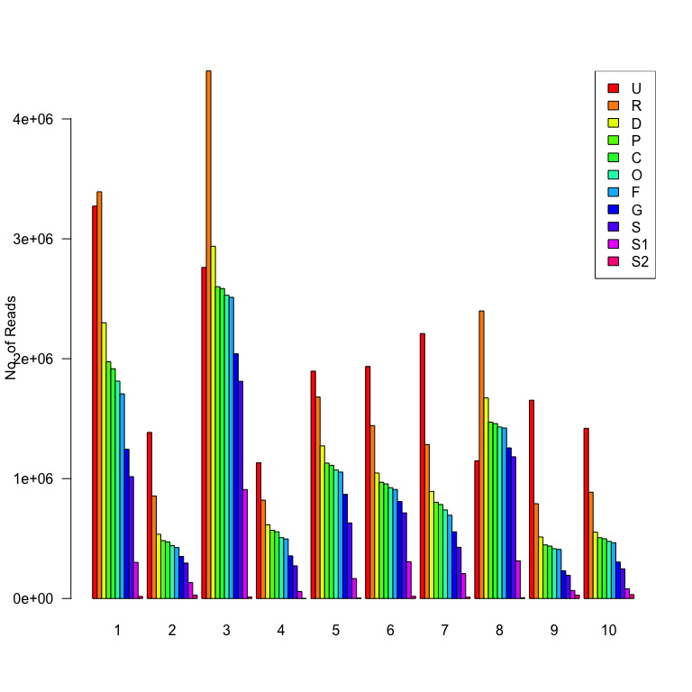

Part II Project - Nanopore Count Analysis
================
Dalia Bornstein
2024-11-21

- [R Analysis of Nanopore Taxonomic Count
  Summaryies.](#r-analysis-of-nanopore-taxonomic-count-summaryies)
  - [Load Libraries](#load-libraries)
  - [Read the Table](#read-the-table)

# R Analysis of Nanopore Taxonomic Count Summaryies.

These have been produced from the Kraken Report files using a perl
script [attached](scripts/read_counts.pl)

## Load Libraries

``` r
library(RColorBrewer); packageVersion("RColorBrewer")
```

    ## [1] '1.1.3'

``` r
library(kableExtra) ; packageVersion("kableExtra")
```

    ## [1] '1.4.0'

``` r
library(ggplot2); packageVersion("ggplot2")
```

    ## [1] '3.5.2'

``` r
theme_set(theme_bw()); # Set ggplot theme
library(dplyr); packageVersion("dplyr")
```

    ## [1] '1.1.4'

``` r
library(gtools); packageVersion("gtools")
```

    ## [1] '3.9.5'

## Read the Table

Read in [nanopore_counts.txt](tables/nanopore_counts.txt) and make a
bar-chart. The first numeric column is unmapped reads, the remaining
columns decay from the total number of mapped reads.

``` r
nanopore_table <- read.table("tables/nanopore_counts.txt",header=TRUE,row.names=1,sep="\t")
subtable=nanopore_table[,c(2:11)]
subtable=subtable[,mixedorder(colnames(subtable))]
nanopore_table[,c(2:11)] <- subtable
colnames(nanopore_table)[2:11] <- colnames(subtable)
kable(nanopore_table[c(1,2,4,6,7,8,9,10,11,12,13),],caption = "Nanopore Metagenomic Classification Levels per Sample")
```

|  | Class | barcode1.krakenreport.txt | barcode2.krakenreport.txt | barcode3.krakenreport.txt | barcode4.krakenreport.txt | barcode5.krakenreport.txt | barcode6.krakenreport.txt | barcode7.krakenreport.txt | barcode9.krakenreport.txt | barcode10.krakenreport.txt | barcode11.krakenreport.txt |
|:---|:---|---:|---:|---:|---:|---:|---:|---:|---:|---:|---:|
| unclassified | U | 3272876 | 1385158 | 2761363 | 1131784 | 1896553 | 1935210 | 2210077 | 1148767 | 1654029 | 1419616 |
| 0 | R | 3391970 | 854646 | 4400352 | 820492 | 1680549 | 1442160 | 1282608 | 2398457 | 790871 | 886717 |
| 4 | D | 2300093 | 535929 | 2937827 | 613897 | 1272976 | 1046637 | 893145 | 1672446 | 513119 | 552751 |
| 8 | P | 1974755 | 483408 | 2600717 | 568909 | 1129395 | 969404 | 802790 | 1470864 | 447224 | 507135 |
| 10 | C | 1916312 | 472225 | 2585415 | 556668 | 1111204 | 955887 | 784022 | 1459000 | 437320 | 498027 |
| 12 | O | 1813104 | 440491 | 2528990 | 507540 | 1071786 | 924091 | 739123 | 1430507 | 415246 | 476406 |
| 14 | F | 1706999 | 424826 | 2512272 | 496931 | 1054614 | 909569 | 694523 | 1422451 | 409516 | 465555 |
| 16 | G | 1245158 | 350514 | 2041107 | 355613 | 868155 | 809022 | 556363 | 1256462 | 231339 | 303846 |
| 18 | S | 1016583 | 295445 | 1811695 | 272493 | 630069 | 714294 | 427192 | 1182237 | 193914 | 247747 |
| 20 | S1 | 301416 | 133116 | 908407 | 58420 | 166640 | 306393 | 207218 | 313694 | 66919 | 80906 |
| 22 | S2 | 17232 | 27878 | 12274 | 813 | 3423 | 18467 | 10467 | 5751 | 28132 | 32803 |

Nanopore Metagenomic Classification Levels per Sample

``` r
barplot(as.matrix(nanopore_table[c(1,2,4,6,7,8,9,10,11,12,13),c(2:11)]),beside=T,col=rainbow(11),las=1,names=c(1:10),ylab="No. of Reads")
legend("topright",nanopore_table[c(1,2,4,6,7,8,9,10,11,12,13),1],fill=rainbow(11))
```

<!-- -->

``` r
pdf("pdf/nanopore_tax_levels.pdf",paper="a4r")
barplot(as.matrix(nanopore_table[c(1,2,4,6,7,8,9,10,11,12,13),c(2:11)]),beside=T,col=rainbow(11),las=1,names=c(1:10),ylab="No. of Reads")
legend("topright",nanopore_table[c(1,2,4,6,7,8,9,10,11,12,13),1],fill=rainbow(11))
dev.off()
```

    ## quartz_off_screen 
    ##                 2
